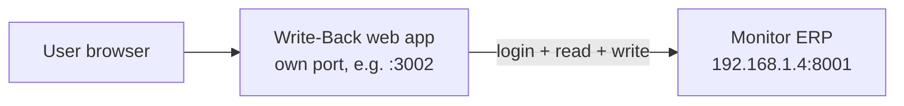

# Monitor ERP Write-Back

Standalone web app that writes **directly to Monitor ERP** (not through the middleware, and not the MIS web app).

## What this project does

Two write-back features:

1. **Price update** — bulk update of part `StandardPrice` from a pasted/uploaded list.
   - Workflow (confirmed with Mr. Wong): **bulk input → Verify (dry-run, show what will change) → Update (actually write)**.
2. **Helipro PO → Sales Order** — create a sales order from a Helipro purchase order.
   - Workflow: upload PO → parse → map codes → preview (dry-run) → create.

## Architecture



- This app is **separate** from:
  - `Monitor ERP Integration` (the sync middleware, `:3001`) — it is read-only and has writes disabled.
  - `Webapp` (MIS web app, `:3000`).
- It logs into the ERP with the API user and issues write **commands** (see below).

---

## Monitor ERP API essentials

- Base URL: `https://{host}:{port}/{lang}/{company}/api/v1`
- Host: `192.168.1.4`, port `8001`, language `en`.
- **Login**: `POST /{lang}/{company}/login` → returns a session id; send it back in the `X-Monitor-SessionId` header.
- **Reads** are REST `GET` (free).
- **Writes** are commands: `POST /{Module}/{Entity}/{Command}` with a JSON body and a **mode**:
  - `Simulate` = dry-run (rolls back) — used by the "Verify" button.
  - `Validate` = dry-run + validation.
  - `execute` = real write — used by the "Update"/"Create" buttons.
- **Writes require the paid "Monitor Full Access API" license** (needs confirming — see todo).
- **Input types**: fields typed `... Input` (e.g. `Decimal Input`) must be sent as `{ "Value": <v> }`.
  - `null` property = "don't change"; `{ "Value": null }` = "clear it".

### Companies

| Number | Purpose |
|---|---|
| `001.1` | Production — Metropoly Packaging Sdn Bhd |
| `001_1.1` | Daily refresh (live copy) |
| `001_2.1` | Training (small, 114 parts) |
| `001_3.1` | Import jobs |

---

## Verified commands (already dry-run tested)

### Price update

```
POST /Inventory/Parts/SetProperties
{ "PartId": "<part id>", "StandardPrice": { "Value": 8.09 } }
```

- `StandardPrice` is a **Decimal Input** → must be wrapped as `{ "Value": ... }`.
- One price per **part** (base unit / rate=1). Other UOM prices derive from base × UOM rate.
- Excel `code` = Monitor `PartNumber` → resolve to `PartId` first via `GET /Inventory/Parts?$filter=PartNumber eq '<code>'`.
- **Dry-run result: 143/143 success, 0 failures.**
- **Input**: the price page accepts the Metropoly `.xlsx` directly (upload), or
  pasted text — either the raw SQL statements or clean `PartNumber [UOM] Price`
  lines. The app extracts each part's rate=1 cost and sanity-checks that every
  other UOM cost = base × rate.

### Sales order (Helipro PO)

Create header:
```
POST /Sales/CustomerOrders/Create
{ "CustomerId": "<Helipro id>", "BusinessContactOrderNumber": { "Value": "HEL-PO-1234" } }
```

Add a line (one per PO line):
```
POST /Sales/CustomerOrders/AddRow
{
  "CustomerOrderId": "<existing order id>",
  "PartId": "<mapped part id>",
  "OrderedQuantity": 5000,
  "Price": 8.09,
  "OrderRowType": 1,
  "DeliveryDate": "2026-10-15T00:00:00+08:00",
  "CustomerOrderRowPosition": "1"
}
```

- This app uses the simpler single-command form: `Create` accepts an embedded
  `Rows` array, so header + all lines are created in one `POST` (verified
  Simulate → HTTP 200).
- `BusinessContactOrderNumber` (the customer's PO number) is a **StringInput** —
  it must be wrapped as `{ "Value": "..." }` on the header. A plain string is
  silently dropped by Monitor.
- `Price` is a **plain decimal** (NOT `{ "Value": ... }`). `StandardPrice` in
  `SetProperties` is a Decimal Input and IS wrapped.
- `DeliveryDate` is a `DateTimeOffset` — send a full ISO datetime (e.g.
  `2026-10-15T00:00:00+08:00`), not a bare date.
- Helipro customer code = `300001` (resolve to `CustomerId` via `GET /Sales/Customers?$filter=Code eq '300001'`).
- Duplicate prevention: the header field `BusinessContactOrderNumber` holds the
  customer's PO number. The app skips creation if it already exists
  (`GET /Sales/CustomerOrders?$filter=BusinessContactOrderNumber eq '<PO#>'`).
- ⚠️ **"Account required"**: adding a row can fail Monitor-side validation when
  the part has no default sales account coding. Parts with proper account
  defaults (e.g. `PE101604`) Simulate fine; others (e.g. `012 YELLOW-I`)
  fail with `Account required` until the account is configured in Monitor or
  `MONITOR_SALES_ACCOUNT_ID` is set.

---

## Credentials

> ⚠️ Credentials live **only** in the local `.env` (gitignored) — see `.env.example`
> for the variable names. Real values are intentionally NOT in this repo.

### Monitor ERP API

| Item | Value |
|---|---|
| Host | `192.168.1.4` |
| Port | `8001` |
| Language | `en` |
| API user | see `.env` |
| API password | see `.env` |
| Insecure TLS | `MONITOR_INSECURE_TLS=true` (self-signed cert) |

### PostgreSQL (MIS) — for reference only (this app mostly talks to ERP)

| Host | `192.168.1.3:5432`, database `MIS` |
|---|---|
| `sync_user` | (sync CRUD — password in local `.env`) |
| `web_postgres` | (MIS web read-only — password in local `.env`) |
| `timbang_postgres` | (factory timbang apps — password in local `.env`) |
| `diniy` | table owner |

### Helipro

- Customer code in Monitor: `300001` (`HELIPRO ENTERPRISE SDN BHD`).
- PO received as **PDF** — parsed by the app's built-in extractor (text-based
  PDFs); scanned/image PDFs must be pasted manually.

---

## Run (dev)

```powershell
npm install
copy .env.example .env   # then fill in real values
npm start               # http://localhost:3002
```

---

## App login & user management

- The app has its own file-based user store (`data/auth.json`) with
  scrypt-hashed passwords and an HttpOnly session cookie (`wb_session`).
  On first start it seeds an admin from `AUTH_ADMIN_USER` /
  `AUTH_ADMIN_PASSWORD` / `AUTH_ADMIN_DISPLAY`.
- The **Settings** page (`/settings.html`, gear icon in the sidebar footer)
  lets any signed-in user change their own password
  (`POST /api/auth/change-password`).
- **Administrators** additionally see a **User accounts** section on the
  Settings page where they can:
  - create / edit / delete users
  - set (reset) a user's password
  - toggle the **Administrator** flag and **active** status
- Safety guards: you cannot delete or deactivate your own account, and the
  last active administrator cannot be removed. Password changes and
  deactivation sign the user out of their other sessions.
- API (all admin-only): `GET/POST /api/admin/users`, `PUT/DELETE /api/admin/users/:id`.

---

## Environment / deployment

- Node: dev `v22.15.0`, server `v24.18.0`. ESM (`"type": "module"`).
- Express 4 + `dotenv` + `multer` (upload) + `pdf-parse` (PDF text).
- Deploy on the server (`192.168.1.3`) as a **new PM2 process on its own port** (e.g. `:3002`), alongside:
  - `monitor-middleware` (sync, `:3001`)
  - MIS web app (`:3000`)
- Server PM2 is invoked via full path: `"%APPDATA%\npm\pm2.cmd"` (not on PATH in some shells).

---

## Current status (as of 2026-10-05)

### Web app ✅ built and dry-run tested
- Express app with two flows wired to the live ERP:
  - `src/services/monitorApi.js` — login + query + `executeCommand` (allows
    `execute`; the middleware's `WRITE_DISABLED` block is intentionally absent).
  - `src/services/writeback.js` — part/customer lookups + the write commands.
  - `src/routes/price.js` — `/api/price/verify` (Simulate) + `/update` (execute).
  - `src/routes/salesorder.js` — `/api/salesorder/parse` (PDF/upload or text),
    `/preview` (Simulate), `/create` (execute).
  - `public/price.html` + `public/salesorder.html` — the UI (Verify → Update,
    Parse → Preview → Create).
- Both flows **Simulate-tested against production `001.1`** (no real writes).

### Price update ✅
- Excel `METROPOLY-PP, HDPE, PE, PP HOLE (01.10.26).xlsx` → 143 items.
- Verified through the app: `PE101604` 7.72 → 8.09 dry-run OK (old vs new shown).
- Value = Excel `refcost` at `rate=1` (base-unit cost) → `StandardPrice`.
- Reference scripts (in the middleware repo `C:\Users\User\Monitor ERP Integration`):
  - `scripts/extract_prices.py` — parse Excel → `scripts/price_data.json`
  - `scripts/map_prices.mjs` — code → part id + old vs new price
  - `scripts/update_prices.mjs` — full 143-item dry-run (Simulate)
  - `scripts/lib/monitorWrite.mjs` — `login()` + `writeCommand()`
  - `scripts/write_command.mjs` — one-off command CLI
- **Not done:** real `execute` (waiting on write-license confirmation).

### Helipro PO → SO 🟡 flow built, one Monitor-side blocker
- `Create` with embedded `Rows` Simulate → HTTP 200 for properly-configured
  parts; duplicate check by `BusinessContactOrderNumber` works.
- Helipro code `300001` confirmed.
- **Blocker:** row creation fails with **"Account required"** for parts that
  lack a default sales account coding (e.g. `012 YELLOW-I`); parts like
  `PE101604` work. Fix by configuring the account in Monitor or setting
  `MONITOR_SALES_ACCOUNT_ID`.
- **PO parsing** (tested on 21 sample PDFs in `C:\Users\User\Documents\Metropoly\PO`):
  extracts Doc No (PO number), ETA (delivery date), and per-line
  code / description / qty / unit price. One scanned PDF (`Metro-PO-MAL-04271`)
  has no text and needs OCR/manual entry.
- **Code mapping** ([src/services/heliproMapping.js](/c:/Users/User/Monitor%20ERP%20Write-Back/src/services/heliproMapping.js)):
  most Helipro POs already use our PartNumbers directly. Seeded translations:
  `COURIERLA → COURIERLA3`, `GARMENT24 → GARMENT2436`, `PPHOLE8120 → PPHOLE81203`.
  `LUNCHBOX3` (3LR Brown lunch box) has no Monitor part yet — map manually.
- **MIS is reference-only**: the old `sl_so` / `sl_sodtl` tables
  (`192.168.1.3` MIS db) show how past Helipro orders were coded, but they may
  be stale and are NOT used by the app.

---

## Reference code (reuse this!)

The working, verified ERP client lives in the middleware repo:

- `C:\Users\User\Monitor ERP Integration\src\services\monitorApi.js`
  - `authenticate(company)`, `query(module, entity, {options, companyNumber})`, `normalizeList(data)`, `executeCommand(...)` (blocks `execute` via `WRITE_DISABLED` — our write-back app must NOT have that block).
- `C:\Users\User\Monitor ERP Integration\scripts\lib\monitorWrite.mjs`
  - `login()` + `writeCommand(endpoint, body, {companyNumber, mode, session})` — this is the base to copy for the write-back app.
- `C:\Users\User\Monitor ERP Integration\ERP_WRITEBACK_PLAN.md`
  - Full plan: flows, payloads, data mapping tables, open questions.

---

## Todo list

### A. Price update web UI
- [x] Scaffold this app (Express, ESM, dotenv).
- [x] Bulk input page (`part number + UOM + price`).
- [x] Verify action → resolve part numbers → `Simulate` → show parts that will change.
- [x] Update action → `execute` `Inventory/Parts/SetProperties`.
- [ ] Deploy on server (new port + PM2).

### B. Helipro PO → Sales Order
- [x] Parse the PDF PO (extract lines) + manual paste fallback.
- [x] Map Helipro item codes → Monitor PartNumbers.
- [x] Preview SO (dry-run).
- [x] Create SO (`CustomerOrders/Create` with embedded `Rows`, `execute`).
- [x] Duplicate check by PO number (`BusinessContactOrderNumber`).

### C. Enablers
- [ ] Confirm "Monitor Full Access API" write license + API user write permission.
- [ ] Confirm bulk input format + whether UOM matters + hosting with Mr. Wong.
